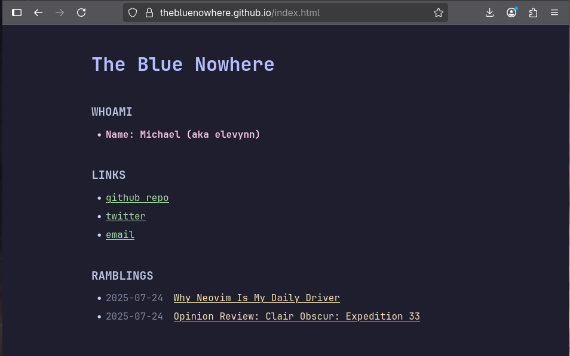

# Minimal CSS Blog

A lightweight, minimal blog built with plain HTML and CSS, designed for simplicity and speed. Hosted with GitHub Pages.

## Features

- Semantic HTML and minimal custom CSS
- No JavaScript or external frameworks
- Fast loading and accessible design
- Fully responsive layout
- Easy to customize and maintain

